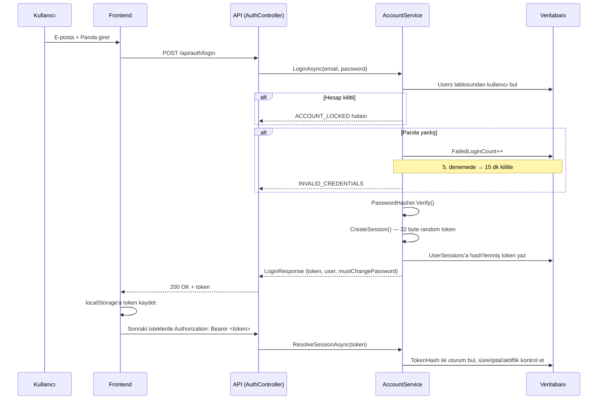
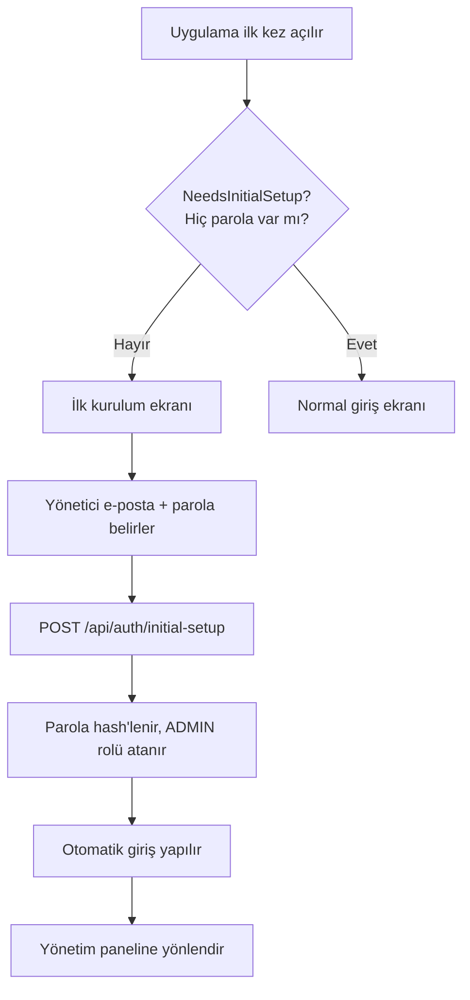
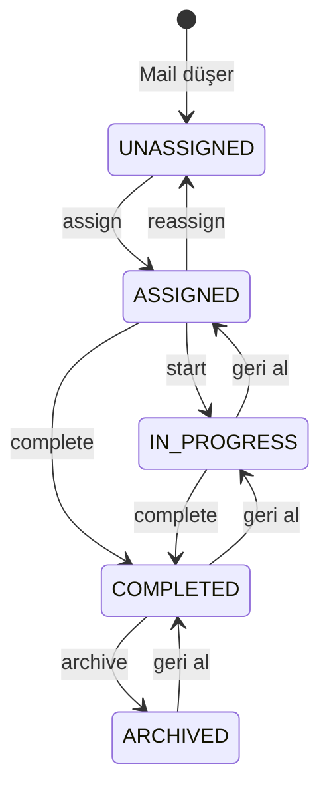
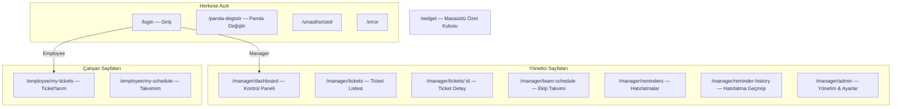
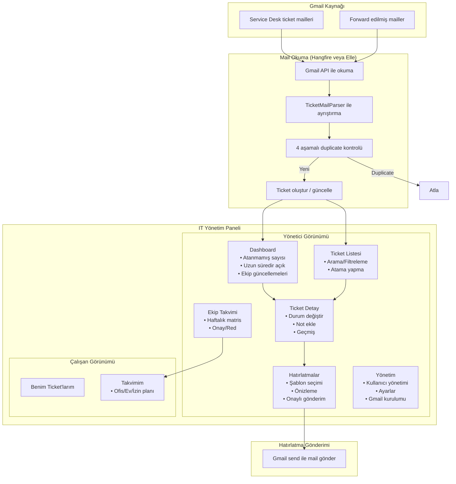

# 📊 IT Yönetim Paneli (Mail-Driven IT Manager Cockpit) — Tam Proje Analizi

## 1. Projenin Amacı

IT müdürünün Gmail kutusuna düşen **Service Desk (Tixbox) ticket maillerini otomatik okuyup ayrıştıran**, ticket'ları bir yönetim panelinde gösteren, çalışanlara atama/hatırlatma yapan ve **hibrit çalışma takvimini** tek ekranda toplayan **iç kullanıma yönelik web uygulaması**.

> [!IMPORTANT]
> **Tixbox'a hiçbir yazma işlemi yapılmaz.** Panel içindeki ticket durumu yalnızca yönetim takibi içindir; Tixbox durumunu değiştirmez.

---

## 2. Teknoloji Yığını

| Katman | Teknoloji |
|--------|-----------|
| **Backend** | .NET 8, ASP.NET Core Web API, EF Core 8, SQL Server (dev) / SQLite (paket), Hangfire, Serilog, FluentValidation, Swagger |
| **Frontend** | React 18, TypeScript, Vite, Material UI (MUI), React Router, TanStack Query, React Hook Form, Zod, Axios |
| **Mail** | Google.Apis.Gmail.v1 (Gmail API) |
| **Mimari** | Modular Monolith → `Api → Infrastructure → Application → Domain` |

---

## 3. Proje Yapısı

```
ticketanaliz/
├── backend/
│   └── src/
│       ├── ItCockpit.Api/            # Controller, Auth, DI, Swagger
│       ├── ItCockpit.Application/    # Parser, servisler, DTO, soyutlamalar
│       ├── ItCockpit.Domain/         # Entity, enum, durum matrisi
│       └── ItCockpit.Infrastructure/ # EF Core, Gmail, Hangfire, mock, seed
│   └── tests/ItCockpit.Tests/        # xUnit testleri
├── frontend/                         # React + Vite + MUI
│   └── src/
│       ├── api/                      # Axios client, hooks, types
│       ├── auth/                     # AuthContext (React Context)
│       ├── components/               # Ortak bileşenler
│       └── pages/                    # Sayfa bileşenleri
├── docs/                             # Dokümantasyon
├── scripts/                          # Paket & widget betikleri
├── baslat.cmd                        # Tek tıkla başlatma
├── ozet-kutusu.cmd                   # Masaüstü özet widget
└── paylas.cmd                        # Ağ paylaşım ayarı
```

---

## 4. 🔐 Kimlik Doğrulama (Auth) Sistemi — Detaylı Analiz

> [!IMPORTANT]
> **AD (Active Directory) auth YOKTUR.** Projede hiçbir zaman Windows AD / LDAP entegrasyonu olmamıştır.

### 4.1 Üç Auth Modu

Sistem `appsettings.json` içindeki `Auth:Provider` ayarına göre **3 farklı modda** çalışabilir:

#### 🅰️ `Mock` Modu (Geliştirme Varsayılanı)
- Parola **sorulmaz**
- Giriş ekranında veritabanındaki aktif kullanıcılar listelenir
- Kullanıcı tıklayarak seçer, `mock:<userId>` formatında token alır
- **Yalnızca geliştirme** içindir
- Handler: [`MockAuthenticationHandler`](file:///C:/Users/EROLE/Desktop/ticketanaliz/backend/src/ItCockpit.Api/Auth/MockAuthenticationHandler.cs)
- `X-Mock-User-Id` header'ı veya `Authorization: Bearer mock:<guid>` ile çalışır

#### 🅱️ `Local` Modu (Üretim Varsayılanı)
- **E-posta + parola** ile giriş
- Hesaplar **yerel veritabanında** tutulur (dış kimlik sağlayıcı yok)
- Parola PBKDF2 ile hash'lenir, DB'de yalnızca hash saklanır
- Oturum token'ı 32 byte kriptografik rastgele, SHA-256 hash olarak DB'de `UserSessions` tablosunda saklanır
- Token `Authorization: Bearer <token>` header'ı ile gönderilir
- **Her istekte** token DB'den kontrol edilir (pasifleştirilen kullanıcının oturumu anında düşer)
- Oturum süresi: **14 gün**
- Handler: [`LocalAuthenticationHandler`](file:///C:/Users/EROLE/Desktop/ticketanaliz/backend/src/ItCockpit.Api/Auth/LocalAuthenticationHandler.cs)

**Güvenlik özellikleri:**
| Özellik | Değer |
|---------|-------|
| Maks hatalı giriş | 5 deneme |
| Hesap kilitleme | 15 dakika |
| Min parola uzunluğu | 8 karakter |
| İlk giriş parola değişimi | Zorunlu (`MustChangePassword`) |
| Parola değişiminde diğer oturumlar | Otomatik iptal |
| Token saklama | SHA-256 hash (açık saklanmaz) |

#### 🅲️ `Google` Modu (SSO — Henüz aktif değil)
- Google OIDC / JWT Bearer ile giriş
- `GoogleClientId` ve `AllowedDomains` (örn: `menarini.com.tr`) gerektirir
- Menarini Workspace doğrulanmamış uygulamalara izin vermediği için **bugün devrede değildir**
- Domain dışı hesaplar reddedilir

### 4.2 Auth Akışı (Local Mod)



### 4.3 İlk Kurulum Akışı

Sistem ilk kez açıldığında (hiçbir kullanıcının parolası yokken):



### 4.4 Rol Tabanlı Yetkilendirme

| Rol | Kod | Yetkiler |
|-----|-----|----------|
| **Admin** | `ADMIN` | Tüm yönetici işlemleri + kullanıcı yönetimi + ayarlar |
| **Manager** | `MANAGER` | Dashboard, tüm ticket'lar, atama, hatırlatma, takvim onayı |
| **Employee** | `EMPLOYEE` | Yalnızca kendi ticket'ları, kendi takvimi |

---

## 5. 🗄️ Veritabanı Tabloları (19 İş Tablosu + Sistem Tabloları)

### Kimlik & Organizasyon (4 tablo)

| Tablo | Açıklama | Önemli Kolonlar |
|-------|----------|-----------------|
| **Users** | Kullanıcılar (soft delete YOK, `IsActive` ile yönetilir) | `Email (UQ)`, `PasswordHash`, `MustChangePassword`, `FailedLoginCount`, `LockedUntilUtc` |
| **Roles** | 3 sabit rol | `ADMIN`, `MANAGER`, `EMPLOYEE` |
| **UserRoles** | Kullanıcı-Rol eşlemesi (composite PK) | `UserId + RoleId` |
| **Teams** | Takımlar (soft delete) | `Name (UQ)`, `ManagerUserId` |

### Oturum Yönetimi (1 tablo — Users'a bağlı)

| Tablo | Açıklama |
|-------|----------|
| **UserSessions** | Sunucu tarafı oturum kayıtları. `TokenHash` (SHA-256), `ExpiresAtUtc`, `RevokedAtUtc`, `LastSeenAtUtc` |

### Ticket Çekirdeği (6 tablo)

| Tablo | Açıklama |
|-------|----------|
| **Tickets** | Ana ticket tablosu — `ExternalTicketNumber (UQ)`, durum makinesi, atama bilgisi |
| **TicketAssignments** | Atama geçmişi — kim, kime, ne zaman |
| **TicketStatusHistory** | Durum değişiklik geçmişi |
| **TicketNotes** | Dahili notlar (soft delete) |
| **TicketMailSources** | Aynı ticket'a ait her mail kaynağı — `GmailMessageId (UQ)`, posta kutusu |
| **TicketParseWarnings** | Mail ayrıştırma uyarıları |

### Ticket Durum Makinesi



### Hibrit Çalışma Takvimi (4 tablo)

| Tablo | Açıklama |
|-------|----------|
| **WorkScheduleWeeks** | Haftalık plan: `DRAFT → SUBMITTED → APPROVED/REJECTED` |
| **WorkScheduleDays** | Gün bazlı: `OFFICE / HOME_OFFICE / LEAVE` |
| **WorkScheduleApprovals** | Onay/red kararları |
| **WorkCalendar** | Resmi tatiller, yarım günler |

### Hatırlatma (2 tablo)

| Tablo | Açıklama |
|-------|----------|
| **ReminderTemplates** | Mail şablonları — placeholder'lar: `{{AssigneeName}}`, `{{TicketCount}}` vb. |
| **ReminderDeliveries** | Gönderim kayıtları — `PENDING / SENT / FAILED` |

### Sistem (3 tablo)

| Tablo | Açıklama |
|-------|----------|
| **AuditLogs** | Denetim kaydı — **asla silinmez** |
| **AppSettings** | Çalışma zamanı ayarları (aging eşikleri, takvim kuralları, Gmail aralığı) |
| **GmailSyncStates** | Posta kutusu senkronizasyon durumu |

---

## 6. 🌐 API Endpoint'leri

### Auth (`/api/auth`)
| Metod | Endpoint | Açıklama | Yetki |
|-------|----------|----------|-------|
| GET | `/setup-status` | İlk kurulum mu, giriş modu ne? | Anonim |
| POST | `/initial-setup` | İlk yönetici parolası | Anonim |
| POST | `/login` | E-posta + parola giriş | Anonim |
| POST | `/logout` | Oturum kapat | Giriş yapmış |
| POST | `/change-password` | Parola değiştir | Giriş yapmış |
| GET | `/mock-users` | Geliştirme kullanıcı listesi | Anonim (Mock modda) |
| POST | `/mock-login` | Geliştirme girişi | Anonim (Mock modda) |
| GET | `/me` | Oturumdaki kullanıcı bilgisi | Giriş yapmış |

### Tickets (`/api/tickets`)
| Metod | Endpoint | Açıklama | Yetki |
|-------|----------|----------|-------|
| GET | `/` | Arama ve filtreleme | Giriş yapmış |
| GET | `/{id}` | Ticket detayı | Giriş yapmış |
| POST | `/` | Elle ticket oluştur | Manager/Admin |
| POST | `/{id}/assign` | Çalışana ata | Manager/Admin |
| POST | `/{id}/status` | Durumu değiştir | Giriş yapmış |
| POST | `/{id}/notes` | Not ekle | Giriş yapmış |
| GET | `/warnings` | Parse uyarıları | Manager/Admin |
| POST | `/warnings/{id}/acknowledge` | Uyarıyı onayla | Manager/Admin |

### Dashboard (`/api/dashboard`)
| Metod | Endpoint | Açıklama | Yetki |
|-------|----------|----------|-------|
| GET | `/` | Yönetim dashboard verileri | Manager/Admin |

### Schedule (`/api/schedule`)
| Metod | Endpoint | Açıklama | Yetki |
|-------|----------|----------|-------|
| GET | `/my-week` | Kendi haftalık planım | Giriş yapmış |
| PUT | `/my-week` | Planı kaydet | Giriş yapmış |
| POST | `/my-week/submit` | Planı gönder | Giriş yapmış |
| GET | `/team` | Ekip takvim matrisi | Manager/Admin |
| GET | `/today` | Bugün kim nerede | Manager/Admin |
| GET | `/user/{userId}` | Kullanıcı haftası | Manager/Admin |
| POST | `/{weekId}/decision` | Onay/Red | Manager/Admin |
| POST | `/{weekId}/override` | Gün override | Manager/Admin |

### Reminders (`/api/reminders`)
| Metod | Endpoint | Açıklama | Yetki |
|-------|----------|----------|-------|
| GET | `/templates` | Şablonlar | Manager/Admin |
| POST | `/preview` | Önizleme | Manager/Admin |
| POST | `/send` | Gönder (onay zorunlu) | Manager/Admin |
| GET | `/history` | Geçmiş | Manager/Admin |

### Ingestion (`/api/ingestion`)
| Metod | Endpoint | Açıklama | Yetki |
|-------|----------|----------|-------|
| GET | `/gmail-status` | Gmail kurulum durumu | Manager/Admin |
| GET/POST/DELETE | `/mailboxes` | Posta kutusu yönetimi | Manager/Admin |
| POST | `/mailboxes/rescan` | Okuma penceresini sıfırla | Manager/Admin |
| POST | `/preview` | Kuru çalıştırma (kaydetmez) | Manager/Admin |
| POST | `/run` | Gmail okuma işini elle tetikle | Manager/Admin |
| POST | `/authorize` | Gmail OAuth onayı | Manager/Admin |
| GET | `/state` | Senkron durumu | Manager/Admin |

### Settings (`/api/settings`)
| Metod | Endpoint | Yetki |
|-------|----------|-------|
| GET | `/` | Manager/Admin |
| PUT | `/` | Manager/Admin |

### Users (`/api/users`)
| Metod | Endpoint | Açıklama | Yetki |
|-------|----------|----------|-------|
| GET | `/` | Aktif kullanıcılar (atama listesi) | Giriş yapmış |
| GET | `/managed` | Yönetim listesi (hesap durumlu) | Manager/Admin |
| POST | `/` | Kullanıcı oluştur | Manager/Admin |
| POST | `/{id}/reset-password` | Parola sıfırla | Manager/Admin |
| POST | `/{id}/active` | Aktif/pasif yap | Manager/Admin |

---

## 7. 🖥️ Frontend Sayfa Yapısı



---

## 8. 🔄 Genel Uygulama Akış Şeması



---

## 9. 📋 Önemli İş Kuralları

| Kural | Detay |
|-------|-------|
| **Duplicate kontrolü** | 4 aşamalı: GmailMessageId → ExternalTicketNumber → SourceRequestId → Subject+Date |
| **Forward tarihi** | En içteki orijinal zarftan alınır |
| **Otomatik atama** | Kişiye özel mail → sistem otomatik atar (`AutoAssigned = true`) |
| **Hatırlatma onayı** | Müdürün `confirmed: true` göndermesi zorunlu |
| **AuditLogs** | Hiçbir koşulda silinmez |
| **Takvim kuralları** | Hafta 3 ofis + 2 home office, Cuma 17:00 kilit |
| **Aging eşikleri** | 2 gün stale, 5 gün old, 7 gün critical |
| **Çalışan izolasyonu** | Yalnızca kendine atanmış ticket'ları görür (sunucu tarafı zorlama) |

---

## 10. 🚀 Çalıştırma ve Dağıtım

| Yöntem | Açıklama |
|--------|----------|
| `baslat.cmd` | Backend + Frontend'i ayrı pencerelerde başlatır |
| `ozet-kutusu.cmd` | Masaüstü widget (her zaman üstte, 60 sn yenileme) |
| `paylas.cmd` | Uygulamayı yerel ağa açar |
| **Taşınabilir paket** | `scripts/paket-olustur.ps1` ile ~119 MB self-contained paket (Node.js/SQL Server gerekmez, SQLite kullanır) |

> [!WARNING]
> Ağ üzerinden paylaşımda parola doğrulaması yoktur (Mock modda). Kurumsal ağda paylaşmadan önce `Auth:Provider = Local` olmalıdır.

---

## 11. Auth Sistemi Özet Değerlendirmesi

> [!NOTE]
> **Sonuç: Projede AD (Active Directory) auth hiç olmamıştır.** Sistem baştan beri 3 modlu (Mock/Local/Google) tasarlanmıştır.

| Auth Modu | Durum | Açıklama |
|-----------|-------|----------|
| `Mock` | ✅ Çalışıyor | Geliştirme — parola yok, listeden seç |
| `Local` | ✅ Çalışıyor | E-posta + parola — üretim varsayılanı |
| `Google` | ⚠️ Kodda var, aktif değil | Menarini Workspace kısıtı nedeniyle kullanılamıyor |
| `AD/LDAP` | ❌ Yok | Kodda hiçbir AD/LDAP referansı bulunmuyor |

**Mevcut üretim yapılandırması:**
```json
{ "Auth": { "Provider": "Local" } }
```

E-posta + parola ile giriş, oturumlar `UserSessions` tablosunda, token her istekte sunucu tarafında doğrulanır.
